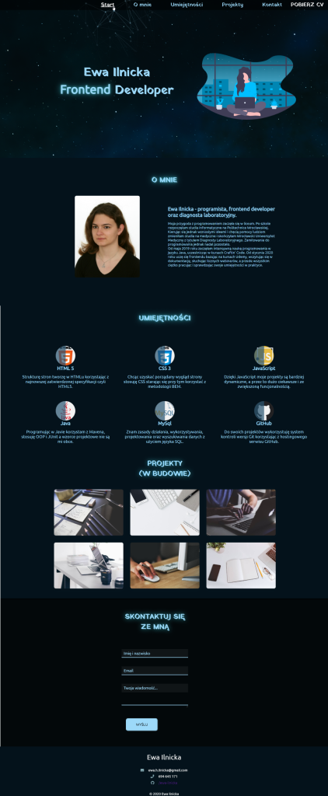
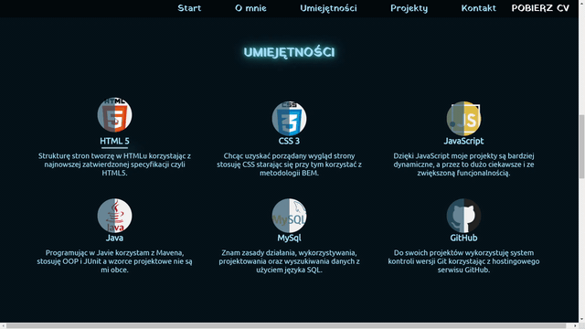

<!--  -->

# My first portfolio

> I'm a frontend developer and with this portfolio I would like to show you my skills.

> I'm still working on it so be sure to check it again any time soon.

> #frontend, #website, #portfolio

***This is the whole view***

- I'm still learning, so there might be some mistakes.

> Theme:

- Night (dark blue with light accents);
- Stars (animation in header looking like moving constellation. Also favicon in shape of stars);
- Shining (some headline have animation 'glow);

> Technologies:

- HTML 5;
- CSS 3;
- JavaScript;
- PHP;

> Tools:

- Visual Studio Code;
- Git;
- https://www.photopea.com/

## Table of Contents

> Sections:

- [Navigation](#navigation)
- [Header](#header)
- [About me](#aboutme)
- [Skills](#skills)
- [Projects](#projects)
- [Contact](#contact)
- [Footer](#footer)

## Navigation

- Each link will take you to the particular section.
- Structure was made in HTML, styling in CSS and script in JQuery.

### RWD

- It's not yet responsive. I'm working on hamburger menu. I started this project with 'Mobile First Design" in mind but something was wrong all the time so I left it for later.

---

## Header

### RWD

- I'm working on it (as in navigation). I experimented with grid, flex and @media but I need some time to make it right.

### Animation

- I found free JS script with animation of moving constellation (adnotation about author is in the script), used it and modified for my design.

## Images

- Icon of girl is in svg format (mit license).
- Background image found on Pixabay (mit license).

---

## About me

> To get started...

### Photo

- Photo made for some documents. I'm thinking about changing it for something less formal and maybe ad some opacity (watermarks seem to be popular).

### Text

- I didn't have any good idea what to write in here, especially that I don't have any experience in IT section yet. I tried to make it short yet interesting (I hope it is). 

---

## Skills

> Found design idea on the Internet (<a href="https://www.youtube.com/channel/UCLjtB1XNaiVz-brRDymb5gg" target="_blank">True Coder</a>) and tried to do it on my own. It is also responsive (I used grid for this - three columns when wide screen, two when smaller and one column for mobiles).

---

## Projects

- **In progress...**
    - I do have some projects but I have to push them on github. Please be patient :)

---

## Contact

Contact form was made in html, CSS and PHP. I do not know PHP so I found free srcipt and used it (and it's working!)

- PHP script found at <a href="https://www.freecontactform.com/form-guides/html-email-form" target="_blank">`freecontactform.com`</a>
- Script didn't work with polish diacritical marks (ąęśćżźł) in field 'Name' so i Had to add them.

---

## Footer

- Icons made by <a href="https://www.flaticon.com/authors/freepik" title="Freepik">Freepik</a> from <a
                href="https://www.flaticon.com/" title="Flaticon"> www.flaticon.com</a>

                ***
                
- Template for README.md by <a href="http://fvcproductions.com" target="_blank">FVCproductions</a>.
